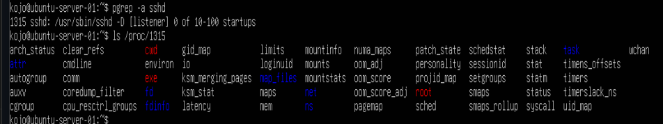
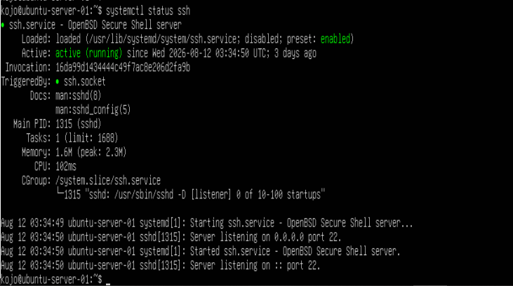
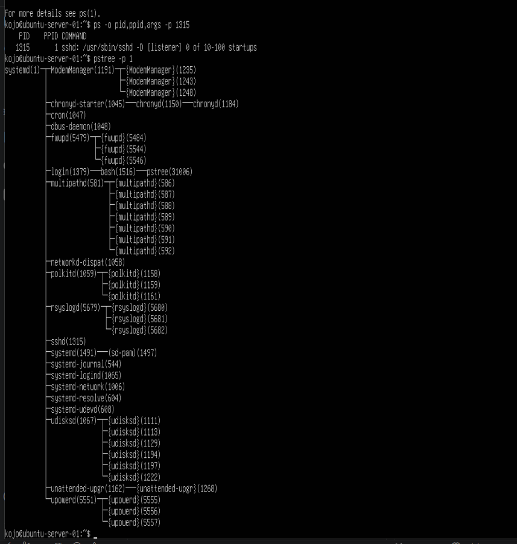
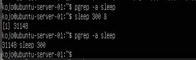

# Project 2 — Linux Services & Process Management

## Overview

This project focuses on understanding how Linux manages system services and running processes.

The lab was performed on an Ubuntu Server environment using OpenSSH as the primary service for investigation and process-management exercises.

The goal was to move beyond memorizing Linux commands and understand the relationship between:

- systemd
- systemctl
- services
- processes
- PIDs
- parent processes
- process monitoring
- process termination

## Objectives

By completing this project, I aimed to:

- Understand the role of systemd in Linux
- Manage services using systemctl
- Start, stop and restart services
- Configure services to start automatically at boot
- Identify running services
- Check service status
- Identify processes associated with a service
- Understand PIDs and PPIDs
- Investigate processes through /proc
- Understand Linux process hierarchy
- Monitor processes and system resources
- Run processes in the background
- Understand Linux signals
- Safely terminate a process
- Develop a basic Linux troubleshooting workflow

## Environment

- Operating System: Ubuntu Server
- Shell: Bash
- Service investigated: OpenSSH
- Service manager: systemd
- Primary SSH process investigated: sshd
- SSH process PID observed: 1315
- Parent PID observed: 1
- PID 1 process: systemd

## Understanding systemd

systemd is the system and service manager used by modern Ubuntu systems.

It is responsible for starting and managing many services and processes during system operation.

A useful mental model used during this project was:

    systemd
       |
       +--- services
       |
       +--- processes
       |
       +--- system management

During this project, the SSH service was used as a practical example of how a Linux service is managed.

The relationship can be viewed as:

    systemd
       |
       +--- ssh.service
                |
                +--- sshd
                     PID 1315

## Managing the SSH Service

OpenSSH was used as the primary service for practicing Linux service management with `systemctl`.

### Start the SSH Service

```bash
sudo systemctl start ssh
```

The `start` command starts the SSH service immediately.

### Stop the SSH Service

```bash
sudo systemctl stop ssh
```

The `stop` command stops the SSH service.

### Restart the SSH Service

```bash
sudo systemctl restart ssh
```

The `restart` command stops and starts the SSH service again.

This is commonly used after making service or configuration changes.

### Enable the SSH Service

```bash
sudo systemctl enable ssh
```

The `enable` command configures SSH to start automatically when the system boots.

### Check SSH Service Status

```bash
systemctl status ssh
```

The `status` command displays information about the SSH service, including whether it is currently running.

During this project, SSH was confirmed to be:

`Active: active (running)`

The status output also showed that the OpenSSH server was listening on port 22.

### List System Services

```bash
systemctl list-units --type=service
```

This command was used to view service units currently loaded by systemd.

The output included services such as:

- `ssh.service`
- `cron.service`
- `systemd-journald.service`
- `systemd-networkd.service`
- `systemd-resolved.service`

---

## Evidence — Hands-On Lab Screenshots

The following screenshots provide evidence of the practical exercises completed during this project.

### 1. Listing Linux Services

The systemd service list was examined using:

```bash
systemctl list-units --type=service
```



### 2. Checking SSH Service Status

The SSH service was verified using:

```bash
systemctl status ssh
```

The service was confirmed to be active and running.



### 3. Identifying the SSH Process

The SSH daemon was located using:

```bash
pgrep -a sshd
```

The SSH process was identified with PID 1315.


### 4. Inspecting Process Information

Detailed information about the SSH process was examined through `/proc`:

```bash
cat /proc/1315/status
```


### 5. Examining Process Hierarchy

The Linux process hierarchy was examined using:

```bash
pstree -p 1
```

This demonstrated the relationship between PID 1 (`systemd`) and the SSH daemon.



### 6. Background Process and Termination

A harmless background process was created and then terminated:

```bash
sleep 300 &
pgrep -a sleep
kill 31148
```

The process was subsequently verified to confirm that it had terminated.


